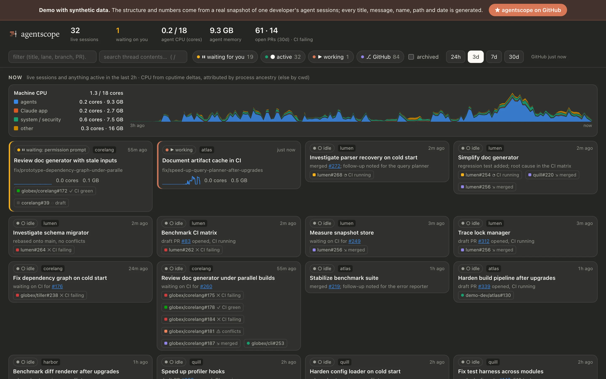
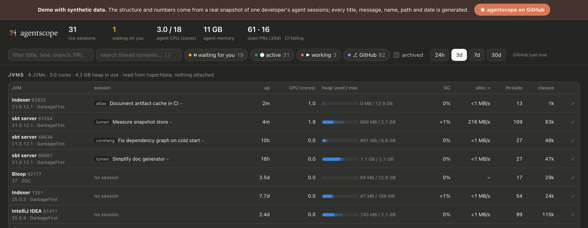
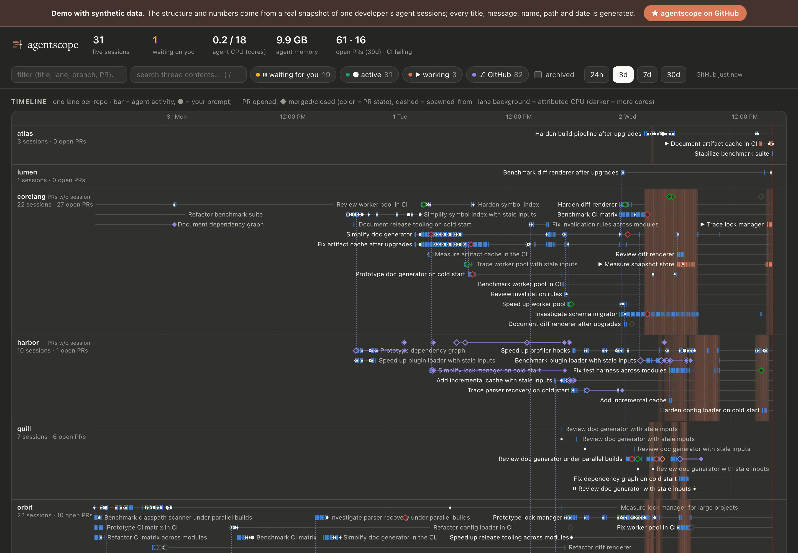
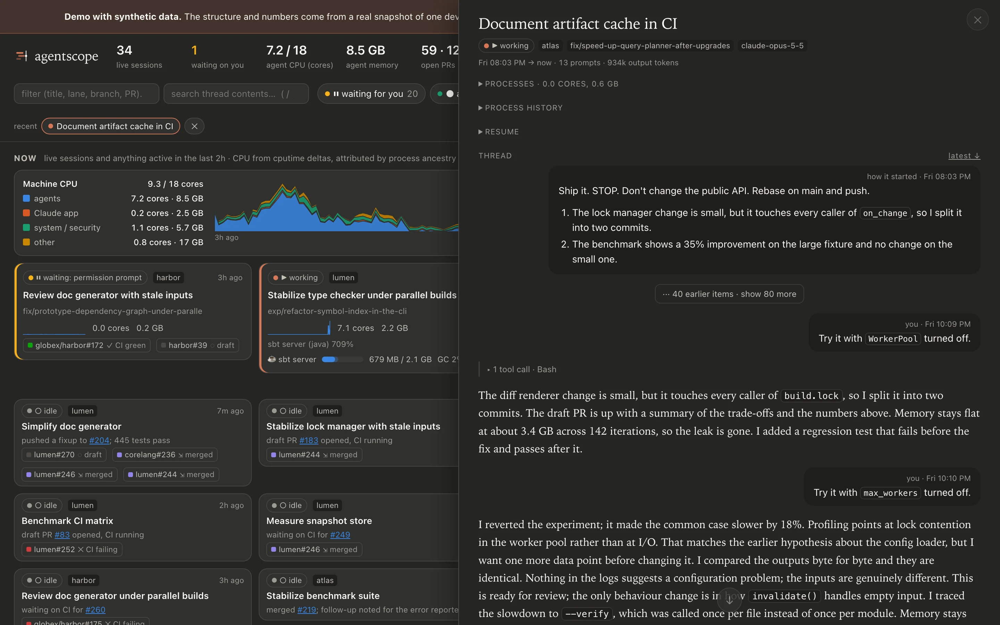
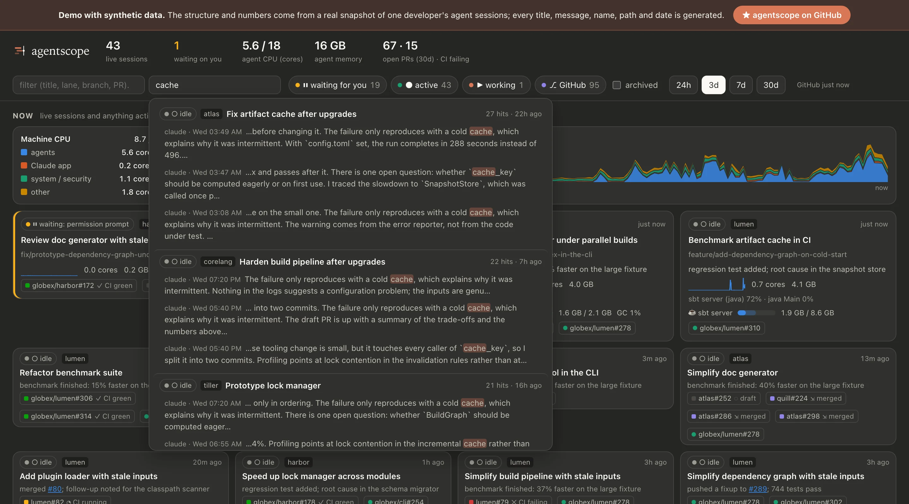
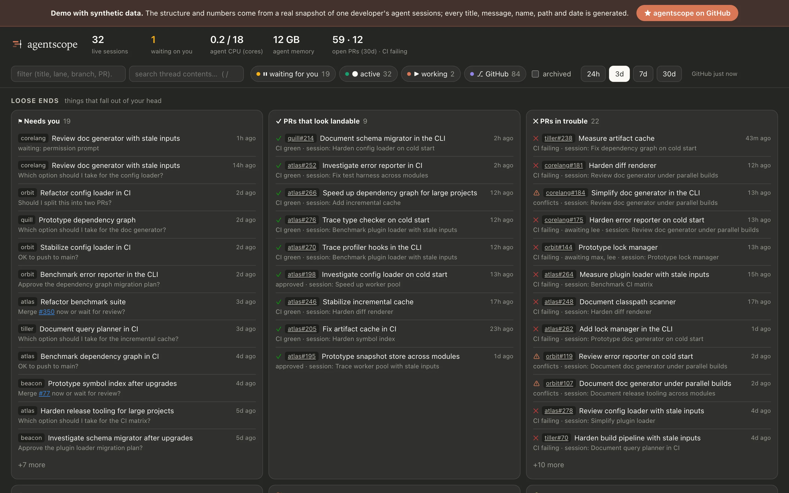
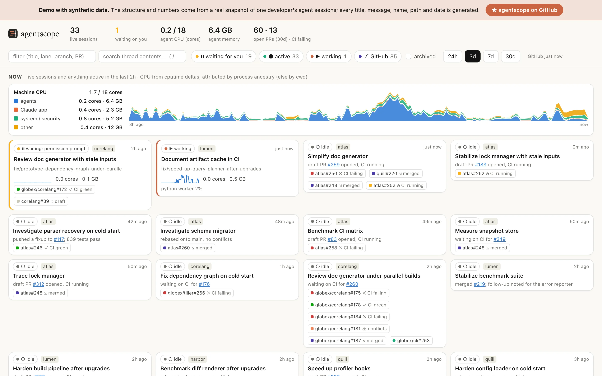

<h1> agentscope</h1>

**One local page for keeping track of many concurrent Claude Code agent sessions: what each one is doing right now, what it has done this week, which PRs it produced, how much of your machine it is using, and what it left waiting on you.**

<p>
  <a href="https://retronym.github.io/agentscope/"><b>▶&nbsp;Try the live demo</b></a>
  &nbsp;·&nbsp; a real snapshot of ~140 sessions with every title, message, name, path and date replaced by synthetic ones
</p>

[](https://retronym.github.io/agentscope/)

## Why

Running a dozen or more agent sessions across several repositories, the Claude app's session list stops being enough. Three things get lost:

- **Right now.** Which sessions are working, which are blocked on a permission prompt or a question, and which one is quietly pinning six cores with a forked build.
- **Over time.** What happened in each repo this week, which session produced which PR, which session spawned which.
- **Loose ends.** Questions an agent asked that you never answered, follow-ups it proposed, PRs that went quiet when their session did. These are exactly the things that fall out of your head.

agentscope reads what Claude Code already records on your machine, joins it with your PRs on GitHub and the live process table, and puts it on one page that refreshes every few seconds.

## What you get

### Now

Live sessions first: waiting on you, then working, then recently active. Each card shows the agent's last status line, attributed CPU and memory with a sparkline, the heavy processes it is running, and its PRs with CI and review state. A machine strip splits total CPU into agents, the Claude app, system/security software and everything else; hover it to see which sessions were busiest at any moment.

Cards stay put: they only reorder when a session's state or CPU tier changes materially, and moves are animated. Status chips (*waiting for you*, *active*, *working*, *GitHub*) filter every view.

### JVMs



Most of the heavy lifting on a card is usually a JVM: an sbt server, Bloop, a Gradle daemon, a forked test run. The JVMs section is a `top` for all of them, read from the counters HotSpot already publishes for `jstat` (`hsperfdata`), so nothing attaches to them and they pay nothing. Each row shows the owning session, uptime, CPU, heap used against committed and max, the share of wall time in GC pauses, an estimated allocation rate, threads and loaded classes. Expand a row for the heap by generation, metaspace, safepoint and JIT time, the JVM's options, and the last three hours per minute.

Session cards get a line for their JVMs, and **JVMs in trouble** in Loose ends lists any that are spending a fifth of their time in GC, stay near their max heap even after collections, or ran a full GC in the last five minutes.

When you want more than counters, an expanded row can take a snapshot, which does attach (via a small Java helper, built once with `mise run build-profiler`):

- **Threads:** two thread dumps a second apart, so every thread comes with what it's doing and how much CPU it used in that second. Threads are grouped by name (`pool-*-thread-*`), busiest first, with deadlocks called out and idle threads hidden until you ask.
- **Heap**, **Class histogram** (asks first: it pauses the JVM to walk the heap) and **Native memory** (when the JVM runs with `-XX:NativeMemoryTracking`).

**Record** in the header turns on continuous profiling: every JVM in scope (agent JVMs, or all of yours) gets a low-overhead JFR recording, picked up as it starts, and the button pulses until you stop it. A JVM's full view (⤢) then shows a sub-second CPU heatmap, one lane per thread coloured by what it's doing (on CPU, in native code, parked, blocked on a lock), and a flame graph of CPU, native, allocation, lock or park time. Drag across the heatmap or lanes to pick a range, click a thread's name to see only that thread, click a frame to zoom. You can also record a single JVM from its full view. Recordings stop when you press Stop or quit agentscope. How much they cost is measured, not guessed: on a javac workload, CPU per compile was the same with and without the recording, within noise (`mise run bench-overhead`). The first recording in a JVM costs a moment of JFR start-up.

While recording, each JVM's row and its session's card say what it's doing (for example *scalac: typer 62% · zinc 20%*), from rules that name compiler phases, test frameworks, dependency resolution and build tools. Every minute of every recording is also kept for a week, losslessly, so **Across JVMs** below the table shows one flame graph over all of them for the last 15 minutes to 7 days, rooted at session, then JVM, then activity, even for JVMs that have since exited.

The design and what's next (async-profiler captures) are in [docs/jvm-profiler.md](docs/jvm-profiler.md).

### Timeline



One lane per repository, with forks and upstream sharing a lane. Each session is a bar shaded by agent activity; dots mark your own prompts, so you can see where your attention went. ◇ and ◆ mark PRs opened and merged, on the row of the session that owns them. Dashed lines join a session to the one that spawned it. A lane's background darkens with the CPU attributed to it; hover to see which processes were behind it.

### Session panel



Click any session for its status, PRs, related sessions, process history, and the transcript as a thread: your turns as bubbles, agent replies rendered from markdown, runs of tool calls collapsed. Every PR and issue reference is a link, including a bare `#123`, which resolves against the session's repository. **↗ Claude** opens the session in the desktop app. Swipe right or press Esc to close; a *recent* strip keeps the last dozen sessions you opened.

### Search



Press `/` to search every prompt and agent message across all sessions (SQLite FTS5: stemmed, all terms required, `"quoted phrases"`). Hits are grouped by session with highlighted snippets; clicking one opens the thread scrolled to that message.

### Loose ends



- **Needs you:** sessions blocked on a prompt, or whose last turn ended with a question to you.
- **PRs that look landable** and **PRs in trouble** (failing CI, changes requested, conflicts).
- **Gone quiet with open PRs:** the session stopped, the PR didn't.
- **Ideas and offers left hanging:** proposals the agent made that you never started, and threads that ended on "should I…" or "follow-up".
- **Open PRs with no session**, and **unarchived sessions idle for days**.

It follows your system's light or dark theme:

 

## How it works

### Attributing load to sessions

CPU comes from cputime deltas between samples every 5 seconds, not from `ps`'s decaying `%cpu`. Each process is credited to a session by, in order:

1. **Ancestry:** it descends from the session's `claude` process (`~/.claude/sessions/<pid>.json` maps PIDs to sessions).
2. **Working directory:** it runs in the session's worktree or scratchpad (scratchpad paths embed the session id).
3. **Sticky:** it was credited earlier and has since daemonized, like an sbt server reparented to launchd.
4. **Mentioned:** it runs in an extra worktree that the session's own tool calls most recently referred to.

### Data sources

Everything is local and read-only except the GitHub query:

| Source | What it provides |
|---|---|
| Desktop app session metadata (`~/Library/Application Support/Claude/claude-code-sessions`) | titles, branches, archived flag, bound PRs, post-turn status summaries, spawn links, proposal outcomes |
| `~/.claude/sessions/*.json` (and every other config dir) | live PID → session, busy / idle / waiting |
| `~/.claude/projects/**/*.jsonl` (likewise) | transcripts: activity, prompts, messages, proposals, token counts |
| `ps`, `lsof` | the process tree, cputime, memory, working directories |
| `hsperfdata_<user>/<pid>` in the temp dir | every JVM's GC, heap, safepoint, thread, class and JIT counters, without attaching |
| `gh api graphql` | your open PRs and those closed in the last 45 days: CI, reviews, mergeability |

agentscope is a plain script. It makes no model calls, and nothing leaves your machine except the GitHub query and the two pinned markdown libraries the page loads from cdnjs.

### Storage

History lives in SQLite at `~/.cache/agentscope/agentscope.db`, one row per minute, from when the server first ran:

- `session_minute`, `bucket_minute`: CPU and memory per session and per machine group. Kept a year.
- `proc`, `proc_minute`: every process that used ≥ 0.5% CPU or ≥ 50 MB in a minute, with its command line, working directory, owning session and how it was attributed. Kept 30 days.
- `jvm`, `jvm_minute`: every JVM seen, with its session, version, collector and options, and its counters per minute. Kept 30 days.
- `frame`, `node`, `tgroup`, `sample_blob`: recorded profiles, as constant pools (frames, stacks as a prefix tree, thread groups) and a compressed blob per JVM, minute and kind. Kept 7 days.
- `msg_fts`: the full-text index over prompts and agent messages.

Anything else is a SQL query away, for example CPU-hours per session today:

```
sqlite3 ~/.cache/agentscope/agentscope.db "select sid, round(sum(cpu)*0.6/3600,2) cpu_h from session_minute where t > strftime('%s','now','start of day') group by sid order by cpu_h desc limit 10"
```

## Getting started

Requirements: macOS, Python 3.10+ (standard library only) and an authenticated [`gh`](https://cli.github.com/). JVM snapshots also need JDK 21+ to build and run the helper: `mise run build-profiler`.

```
git clone https://github.com/retronym/agentscope && cd agentscope
python3 agentscope.py        # or: mise run serve
```

Then open http://localhost:8377. To try changes without touching your history, run a second copy on a scratch database: `python3 agentscope.py --port 8378 --db dist/dev.db`. Load history accumulates while the server runs, so leave it running.

**Several Claude accounts?** If you run `claude` with different `CLAUDE_CONFIG_DIR`s (e.g. `alias claude-work='env CLAUDE_CONFIG_DIR=$HOME/.claude-work claude'`), agentscope reads `~/.claude`, `$CLAUDE_CONFIG_DIR` and every `~/.claude-*` directory that holds sessions, and tags each session with the one it came from. To choose explicitly, pass `--claude-dir` once per directory, or set `AGENTSCOPE_CLAUDE_DIRS` (colon-separated). The startup line lists the directories in use.

Endpoint-security and MDM agents can be grouped under *system / security* with `AGENTSCOPE_SYSTEM_HINTS="SomeAV:mdm-agent"` (colon-separated command-line substrings).

The formats agentscope reads are Claude Code internals, not a public API, and may change between releases.

## Publishing a demo of your own

```
mise run demo          # writes dist/index.html: one self-contained file
mise run demo-serve    # export, then serve it on http://localhost:8380
mise run publish-demo  # force-push dist/index.html to the gh-pages branch
mise run screenshots   # regenerate docs/screenshots from the demo (headless Chromium)
```

The exporter keeps the *structure* of a real snapshot (timings, activity patterns, CPU and memory, statuses, PR states, session families, process trees) and replaces every piece of *text* with generated stand-ins of the same shape: titles, prompts, agent messages, branches, repo and owner names, PR titles, paths and command lines. A paragraph becomes a paragraph of similar length, a table a table, a list a list.

Before writing, it checks every string against a denylist built from the real snapshot (your GitHub login, home path, repo and owner names, session and PR titles, branch names) and refuses to write if anything survives. Timestamps are shifted back by a random 20–60 days plus some hours, drawn per export and never stored. GitHub records Pages deployment times publicly, though, so publishing right after exporting lets anyone estimate the offset.

## Future work

- **Talk to sessions from the page.** Reply to a session that is waiting on you, or nudge an idle one, without switching to the app. Leads:
  - Each live CLI session advertises a local socket (`messagingSocketPath`, `peerProtocol: 1` in `~/.claude/sessions/<pid>.json`). Sessions already use it to message each other, but it is undocumented, and a message sent that way arrives as a note from another agent rather than as the user.
  - The desktop app's `claude://code/new` deep link accepts a prompt (`q`) for a *new* session. There is no equivalent route for an existing one yet.
  - Remote Control sessions are reachable through an authenticated cloud channel, but that needs your claude.ai credentials, which a local dashboard shouldn't hold.

  Whichever channel, the server needs a safety gate before anything can type into a session that runs commands with your permissions. That means a random token printed at startup and required on every send (as Jupyter does), an `Origin` check against cross-site requests, binding to localhost only, and every sent message labelled as coming from agentscope.
- **Token usage.** Transcripts already record per-message usage: input, output, cache reads and writes, and model. Today only output tokens are summed. Next: tokens and cost per session, lane and day alongside CPU, cache hit rates, and "tokens per merged PR".
- **Review requests:** PRs where your review is requested, not just ones you authored.
- **Dismissing loose ends** you've dealt with, so the lists shrink.
- **Linux support:** `ps`/`lsof` differences and the app's session paths.
- **A launchd agent** so load history is always being recorded.

## License

[Apache 2.0](LICENSE)
